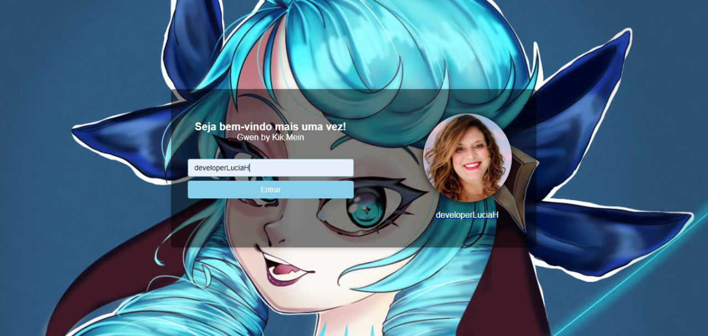
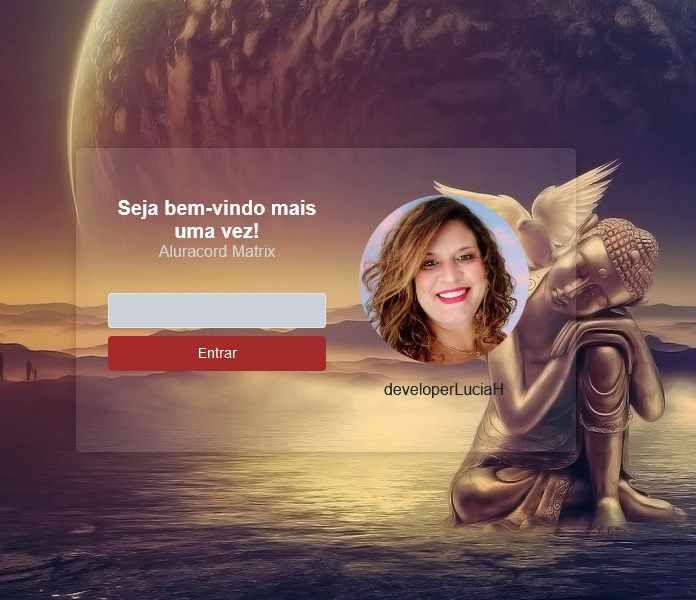
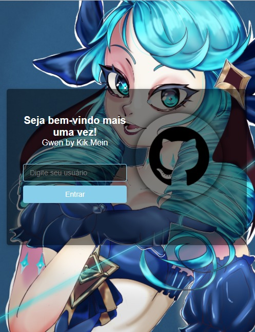
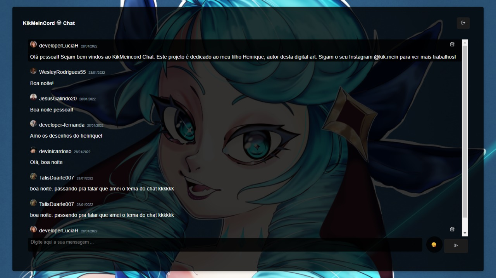
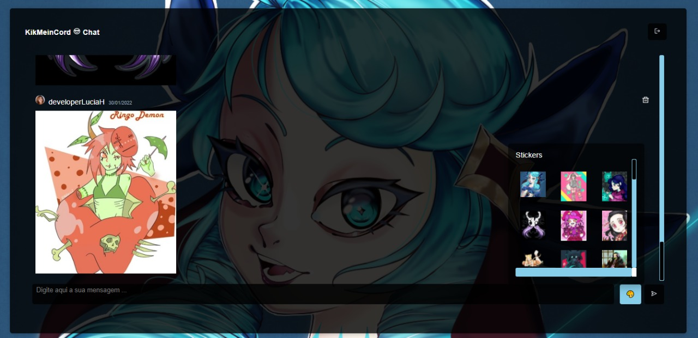

# Aluracord-Matrix - REACT
# 🚀 Projeto desenvolvido durante a Imersão React da Alura
### Dedicado ao meu filho Henrique, autor da releitura do desenho Gwen. Sigam o seu Instagram para acompanhar suas Digital Arts autorais: @kik.mein 🧑‍🎨 
### https://www.instagram.com/kik.mein/
 
 
https://vercel.com/developerluciah/aluracord-matrix
 
https://aluracord-matrix-olive-one.vercel.app/

 

<h3>IMAGENS DO PROJETO</h3>
 
<h4> Tela de Computador </h4>

 
<h4> Tela de Tablet </h4>

 
<h4> Tela de Mobile  Foto Padrão antes do Submit </h4>

 
<h4> Tela de Chat </h4>

 
<h4> Stickers </h4>

